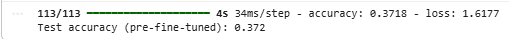
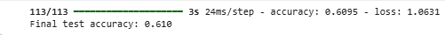
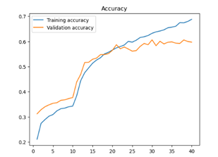
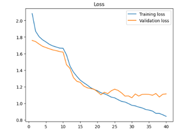
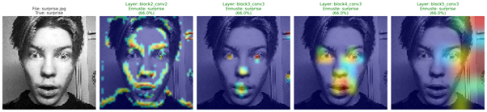
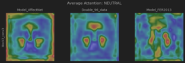
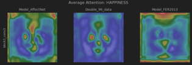

# Facial expression recognition from images

**Authors:** Maria Aalto, Eetu Oinonen, Pavel Degterev, Suphitcha Pitkänen  
**Course:** Neuroverkkoprojekti (Neural Network Project) TX00EY34-3003  
**Date:** 08.12.2025

## 1. Introduction

**Project goal and motivation:**  
The goal of this project was to develop a machine learning model that recognizes human facial expressions from images. The project focuses on transfer learning with the **VGG16** architecture and on using data augmentation to improve generalization. The aim was to preprocess image data, train a neural network to classify facial expressions into seven emotion categories (*happy, sad, angry, disgust, fear, surprise, neutral*), and evaluate its accuracy.

**Chosen approach:**  
We used a pretrained **VGG16 model** whose weights were originally trained on ImageNet. VGG16 was chosen because it is a well‑known and effective **feature extractor** for image recognition tasks.

The project was extended by training multiple models on different datasets and evaluating their reliability via **cross‑validation**. In addition, we analyzed the internal behavior and decision process of the models by visualizing predictions with heatmaps.

## 2. Datasets and preprocessing

**Datasets:**  
We used three different Kaggle datasets:

1. **FER-2013** (Facial Expression Recognition 2013) – about **35,900 grayscale images (48×48 pixels)**, containing many noisy, low‑quality or mislabelled/duplicate samples.  
2. **AffectNet** (Affective Computing from the Internet) – about **30,600 color images (96×96 pixels)** of high quality with manually validated labels.  
3. **CK+** (Extended Cohn–Kanade) – about **900 grayscale images (48×48 pixels)**, with actors posing different emotions in controlled lab conditions.

**Preprocessing and transformations:**

- **Splits:** Each dataset was split into train (80 % of training data), validation (20 % of training data), and test sets (separate test folder).  
- **Data augmentation:** To reduce overfitting and increase data diversity, we used a pipeline with random horizontal flip, rotation (10 %) and zoom (20 %).  
- **Rescaling:** Pixel values were scaled to [0, 1] using `Rescaling(1.0/255)`.  
- **Color conversion:** Although many images are grayscale, VGG16 expects three color channels. In code and Grad‑CAM visualization we handled this by converting images to RGB or by using Keras preprocessing layers.

## 3. Model architecture and implementation

**Model structure:**  
The model was implemented using the Keras Functional API. The core is a VGG16 base (`include_top=False`) with a custom classification head on top.

Layers in order:

1. **Input & augmentation:** Input image (48×48×3) passes through augmentation layers.  
2. **VGG16 base:** Pretrained convolutional backbone compressing the image into a feature map of shape (1, 1, 512).  
3. **GlobalAveragePooling2D:** Flattens the feature map into a vector of length 512.  
4. **BatchNormalization:** Normalizes activations to stabilize training.  
5. **Dense (128, ReLU):** Fully connected layer to interpret features.  
6. **Dropout (0.3):** Drops 30 % of neurons at random to reduce overfitting.  
7. **Output (7, Softmax):** Predicts a probability distribution over the seven emotion classes.

**Training strategy (two phases):**

1. **Feature extraction (frozen base):**  
   - VGG16 base frozen (`trainable = False`).  
   - Only the custom head is trained for 10 epochs with Adam optimizer (lr = 1e‑4).

2. **Fine‑tuning:**  
   - The last VGG16 blocks are unfrozen (in code, `base_model_layer.layers[:-12]` remain frozen).  
   - The entire model is fine‑tuned for 25 epochs with a very small learning rate (1e‑5).

We experimented with different hyperparameters: number of epochs (10–30), batch size (32/64), size of the dense layer (128/256), and learning rate. The final configuration and architecture were selected based on the best performance.

## 4. Results and observations

**Overall performance:**  
Model accuracy improved significantly after fine‑tuning.

- **Phase 1 (frozen base):**  
  The model learned only basic features and achieved relatively low accuracy.

- **Phase 2 (fine‑tuning):**  
  When VGG16 was allowed to adapt to the FER dataset, accuracy increased clearly.

**Learning curves:**

- **Accuracy:** Around epoch 10 (start of fine‑tuning) there is a clear jump in accuracy. Training accuracy eventually approaches ~70 %, while validation accuracy stabilizes around ~60 %.  

- **Loss:** Validation loss starts to flatten and even rise slightly after ~30 epochs, indicating the onset of overfitting despite Dropout and data augmentation.

**Model interpretation (Grad‑CAM):**  
We used Grad‑CAM (Gradient‑weighted Class Activation Mapping) to see which regions of the image the model uses for its decisions.

In one example, the model predicts “surprise” with 66 % confidence. The heatmap shows strong focus on the **eyes and mouth**, which are key areas for surprised expressions. This indicates that the model is learning relevant facial features rather than background noise.

Layer‑wise view:

- **Early layers (e.g., Block 2):** Emphasize general shapes and edges.  
- **Deeper layers (Blocks 4–5):** Grad‑CAM highlights broader, more abstract regions of the face, suggesting higher‑level semantic understanding of expressions.

## 5. Data and model comparison

To analyze performance, we performed cross‑testing with three different test sets: AffectNet, FER-2013 and CK+. Results were summarized in a comparison table.

| Model          | Test_AffectNet | Test_FER2013 | Test_CKPlus |
|----------------|----------------|--------------|-------------|
| Double_96_data | 70.8%          | 65.1%        | 88.3%       |
| Double_48_data | 58.0%          | 61.5%        | 81.9%       |
| Model_AffectNet| 69.3%          | 44.0%        | 66.1%       |
| Model_FER2013  | 29.0%          | 65.3%        | 80.3%       |
| Initial_model  | 28.1%          | 60.2%        | 80.4%       |
| Model_CKPlus   | 26.4%          | 29.7%        | 95.8%       |

Key observations:

- The base model’s initial accuracy was about 60 %.  
- Increasing the input resolution to 96×96 improved accuracy by ~5 %. This can be explained by the last convolutional feature map growing from 1×1×512 to 3×3×512, giving more spatial detail to the final layers. This resolution effect was consistent in experiments.  
- Performance on AffectNet remained weak despite these improvements.

A similar pattern occurred with the AffectNet‑based model: strong performance on its own dataset but poor generalization to the others. The CK+‑trained model showed even more overfitting; therefore it was not used for further training, but it was useful diagnostically because its clean images made model weaknesses easier to interpret.

Ultimately, **combining multiple datasets** improved generalization significantly. VGG16 is naturally optimized for color images, which partly explains difficulties with purely grayscale datasets and highlights the importance of diverse data for developing the model’s “understanding”.

## 6. Findings and XAI analysis

The central question was: can a model overfit to two different datasets at the same time, or does it truly learn to generalize better (“get smarter”)? Single‑image tests gave a rough idea, but not enough to capture the dynamics of change. Therefore we analyzed **averaged Grad‑CAM heatmaps** over samples of 200 images.

The results showed a clear shift in model focus. Over time, the model stopped searching for salient cues in the background and focused increasingly on the **faces themselves**. In the averaged heatmaps this appears as a transition from diffuse attention to strongly localized activations on central facial regions.

## 7. Discussion and challenges

Although we did not reach the 90 % target even with the best model (maximum ~88 % on a synthetic dataset), the achieved level is competitive. On AffectNet we reached ~72 % accuracy and on FER-2013 about 65 %, which is comparable to reported human performance on these challenging datasets.

Fine‑tuning was crucial; using only frozen‑base transfer learning left accuracy below 40 %. At the same time, interpretation of results must consider the **Kuleshov effect**: emotion recognition is inherently context‑dependent and subjective, which sets a natural upper bound on achievable accuracy from static images alone.

Main challenges:

- **Class imbalance:** Large differences in class sizes (e.g., “Happy” vs. “Disgust”) hurt performance on rarer expressions.  
- **Overfitting:** Visible both in learning curves and cross‑testing. Models quickly adapted to their own dataset but failed on others, indicating limited generalization.  
- **Resource demands:** VGG16 is heavy (~14.7M parameters), requiring significant compute and slowing down iteration cycles.  
- **Similar expressions:** Some emotions are intrinsically very close to each other, causing misclassifications that also humans would make when judging a single static frame without context.

## 8. Summary

The project shows that fine‑tuning a pretrained VGG16 and combining multiple datasets are effective strategies for facial expression recognition. Fine‑tuning substantially boosted accuracy, and cross‑testing at different resolutions revealed the true generalization behavior of the models. Grad‑CAM analysis confirmed that the model’s attention shifted from background to relevant facial regions.

While the model can still be technically improved, substantial gains in accuracy would likely require additional modalities and context (e.g., video, audio, or situational information) rather than just more static images.

## 9. Use of AI tools

AI tools were used in the following ways:

- **Code:** We consulted documentation and language models for the Grad‑CAM implementation, then adapted it for grayscale images and the VGG16 architecture.  
- **Reporting:** AI helped design the structure of this report and validate our interpretations.  
- **Debugging:** Some TensorFlow / CUDA configuration tweaks (e.g., `tf_xla_enable_xla_devices`) were added based on AI suggestions to mitigate warnings and improve stability.
